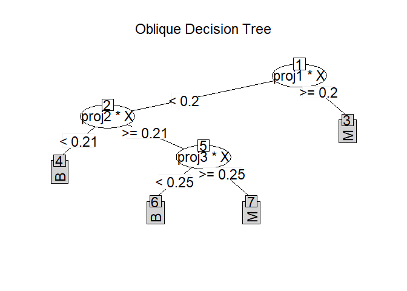

<!-- README.md is generated from README.Rmd. Please edit that file -->

```{r, include = FALSE}
knitr::opts_chunk$set(
  collapse = TRUE,
  comment = "#>",
  fig.path = "man/figures/README-",
  out.width = "100%"
)
```

# ODRF <a href='https://liuyu-star.github.io/ODRF/'></a>

<!-- badges: start -->
[](https://CRAN.R-project.org/package=ODRF)
[](https://github.com/liuyu-star/ODRF/actions/workflows/R-CMD-check.yaml)
[](https://github.com/liuyu-star/ODRF/actions/workflows/pkgdown.yaml)
[](https://lifecycle.r-lib.org/articles/stages.html#stable)
<!-- badges: end -->

ODRF implements the well-known Oblique Decision Tree (ODT) and ODT-based Random Forest (ODRF), which uses linear combinations of predictors as partitioning variables for both traditional CART and Random Forest. A number of modifications have been adopted in the implementation; some new functions are also provided.
<!--
The goal of ODRF is to supplement classical CART and random forests for classification and regression. The use of linear combinations of predictors as splitting variables is one of the important extensions of CART and is known as Oblique Decision Trees (ODT) and ODT-based Random Forests (ODRF).
-->

<!--
[](https://app.codecov.io/gh/liuyu-star/ODRF?branch=main)
-->

<!--
The ODRF R package allows users to define their own functions to find the projections of at each node, which is essential to the performance of the forests. We also provide a complete comparison and analysis for other ODT and ODRF. You can learn more about them in `vignette("ODRF")`.
-->
## Overview

The ODRF [R package](https://cran.r-project.org/) consists of the following main functions:

* `ODT()` classification and regression using an ODT in which each node is split by a linear combination of predictors.
* `ODRF()` classification and regression implemented by the ODRF It’s an extension of random forest based on ODT() and includes random forest as a special case.
* `Online()` online training to update existing ODT and ODRF by using new data sets.
* `prune()`  prune ODT from bottom to top with validation data based on prediction error.
* `print()`, predict() and plot() the base R functions in the base R Package to class ODT and ODRF.

`ODRF` allows users to define their own functions to find the projections at each node, which is essential to the performance of the forests. We also provide a complete comparison and analysis for other ODT and ODRF, more details are available in vignette("ODRF").

## Installation

You can install the development version of ODRF from [GitHub](https://github.com/) with:

``` r
# install.packages("devtools")
devtools::install_github("liuyu-star/ODRF")
```

## Usage

We show how to use the ODRF package with examples.

### Classification and regression using ODT and ODRF

Examples of classification and regression using ODRF and ODT are as follows.
```{r classification and regression}
library(ODRF)
data(seeds, package = "ODRF")
set.seed(12)
train <- sample(1:209, 150)
seeds_train <- data.frame(seeds[train, ])
seeds_test <- data.frame(seeds[-train, ])
forest <- ODRF(varieties_of_wheat ~ ., seeds_train, split = "gini", 
  parallel = FALSE)
pred <- predict(forest, seeds_test[, -8])
(e.forest <- mean(pred != seeds_test[, 8]))
data(body_fat, package = "ODRF")
train <- sample(1:252, 200)
bodyfat_train <- data.frame(body_fat[train, ])
bodyfat_test <- data.frame(body_fat[-train, ])
tree <- ODT(Density ~ ., bodyfat_train, split = 'mse')
pred <- predict(tree, bodyfat_test[, -1])
(e.tree <- mean((pred - bodyfat_test[, 1])^2))
```

In the following example, suppose the training data are available in two batches. The first batch is used to train ODT and ODRF, and the second batch is used to update the model by online. The error after the model update is significantly smaller than that of one batch of data alone.

Update existing ODT and ODRF with online.
```{r online}
set.seed(17)
index <- sample(nrow(seeds_train), floor(nrow(seeds_train) / 2))
forest1 <- ODRF(varieties_of_wheat ~ ., seeds_train[index, ],
  split = "gini", parallel = FALSE)
pred <- predict(forest1, seeds_test[, -8])
(e.forest.1 <- mean(pred != seeds_test[, 8]))
forest2 <- online(forest1, seeds_train[-index, -8], seeds_train[-index, 8])
pred <- predict(forest2, seeds_test[, -8])
(e.forest.online <- mean(pred != seeds_test[, 8]))
index <- seq(floor(nrow(bodyfat_train) / 2))
tree1 <- ODT(Density ~ ., bodyfat_train[index, ], split = 'mse')
pred <- predict(tree1, bodyfat_test[, -1])
(e.tree.1 <- mean((pred - bodyfat_test[, 1])^2))
tree2 <- online(tree1, bodyfat_train[-index, -1], bodyfat_train[-index, 1])
pred <- predict(tree2, bodyfat_test[, -1])
(e.tree.online <- mean((pred - bodyfat_test[, 1])^2))
```

prune first judges whether the error of  new data is reduced or not if applied, starting from the last leaf nodes. For ODRF, if argument 'useOOB=TRUE' then it uses 'out-of-bag' for pruning. Examples are as follows.
```{r prune}
set.seed(4)
bodyfat_train=rbind(as.matrix(bodyfat_train),matrix(rnorm(3000*5),5*200,15))
seeds_train=rbind(as.matrix(seeds_train),matrix(rnorm(1200*5),5*150,8))
bodyfat_train[-seq(200),1]=sample(bodyfat_train[seq(200),1],5*200,
  replace = TRUE)
seeds_train[-seq(150),8]=sample(seeds_train[seq(150),8],5*150,
  replace = TRUE)
index <- sample(nrow(seeds_train), floor(nrow(seeds_train) / 2))
forest1 <- ODRF(seeds_train[index, -8], seeds_train[index, 8],
  split = "gini", parallel = FALSE)
pred <- predict(forest1, seeds_test[, -8])
(e.forest.1 <- mean(pred != seeds_test[, 8]))
forest2 <- prune(forest1, seeds_train[-index, -8], seeds_train[-index, 8], 
  useOOB = FALSE)
pred <- predict(forest2, seeds_test[, -8])
(e.forest.prune1 <- mean(pred != seeds_test[, 8]))
forest3 <- prune(forest1, seeds_train[index, -8], seeds_train[index, 8])
pred <- predict(forest3, seeds_test[, -8])
(e.forest.prune2 <- mean(pred != seeds_test[, 8]))
index <- sample(nrow(bodyfat_train), floor(nrow(bodyfat_train) / 2))
tree1 <- ODT(bodyfat_train[index, -1], bodyfat_train[index, 1], split = 'mse')
pred <- predict(tree1, bodyfat_test[, -1])
(e.tree.1 <- mean((pred - bodyfat_test[, 1])^2))
tree2 <- prune(tree1, bodyfat_train[-index, -1], bodyfat_train[-index, 1])
pred <- predict(tree2, bodyfat_test[, -1])
(e.tree.prune <- mean((pred - bodyfat_test[, 1])^2))
```
Note that, prune does not always improve efficiency  because the number of observers in the training set is too small to build a simple tree structure. Therefore, we expand the training set with random numbers to make prune effective.


### print the tree structure of ODT and  ODRF
```{r print}
data(iris, package = "datasets")
tree <- ODT(Species ~ ., data = iris)
print(tree)
party.tree <- as.party(tree, data = iris)
print(party.tree)
forest <- ODRF(Species ~ ., data = iris, parallel = FALSE)
print(forest)
```

### Plot the tree structure of ODT
```{r plot, fig.height=4.0,fig.width=5.0}
plot(tree)
```

## Getting help

If you encounter a clear bug, please file an issue with a minimal reproducible example on [GitHub](https://github.com/liuyu-star/ODRF/issues).

---

Please note that this project is released with a [Contributor Code of Conduct](https://liuyu-star.github.io/ODRF/CONTRIBUTING).
By participating in this project you agree to abide by its terms.


