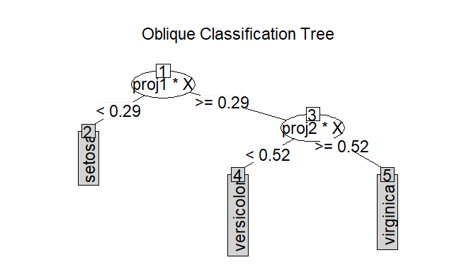

<!-- README.md is generated from README.Rmd. Please edit that file -->

# ODRF <a href='https://dplyr.tidyverse.org'></a>

<!-- badges: start -->

[](https://app.codecov.io/gh/liuyu-star/ODRF?branch=main)
[](https://CRAN.R-project.org/package=ODRF)
[](https://github.com/liuyu-star/ODRF/actions/workflows/R-CMD-check.yaml)
[](https://circleci.com/gh/liuyu-star/ODRF)
<!-- badges: end -->

The goal of ODRF is to supplement classical CART and random forests for
classification and regression. The use of linear combinations of
predictors as splitting variables is one of the important extensions of
CART and is known as Oblique Decision Trees (ODT) and ODT-based Random
Forests (ODRF).

## Overview

The ODRF [R Package](https://cran.r-project.org/) consists of the S3
method as follows:

- `ODT()` classification and regression using an ODT in which each node
  is split by a linear combination of predictors.
- `ODRF()` classification and regression implemented by the ODRF. It’s
  an extension of random forest and include random forest as a special
  case.
- `Online()` online structural training to update existing `ODT` and
  `ODRF` by using batches of data.
- `prune()` prune `ODT` from bottom to top with validation data based on
  prediction error.
- `print()`, `predict()` and `plot()` the base R functions in the base R
  Package to class `ODT` and `ODRF`.

The ODRF R package allows users to define their own functions to find
the projections of at each node, which is essential to the performance
of the forests. We also provide a complete comparison and analysis for
other ODT and ODRF. You can learn more about them in `vignette("ODRF")`.

## Installation

You can install the development version of ODRF from
[GitHub](https://github.com/) with:

``` r
# install.packages("devtools")
devtools::install_github("liuyu-star/ODRF")
```

## Usage

We show how to use the ODRF package with examples.

### Classification and regression with functions `ODT()` and `ODRF()`

Classification with Oblique Decision Tree.

``` r
library(ODRF)
#> 载入需要的程辑包：partykit
#> 载入需要的程辑包：grid
#> 载入需要的程辑包：libcoin
#> 载入需要的程辑包：mvtnorm
data(seeds, package = "ODRF")
set.seed(18)
train <- sample(1:209, 120)
train_data <- data.frame(seeds[train, ])
test_data <- data.frame(seeds[-train, ])
index <- seq(floor(nrow(train_data) / 2))

forest <- ODRF(varieties_of_wheat ~ ., train_data,
  type = "i-classification", parallel = FALSE
)
pred <- predict(forest, test_data[, -8])
e.forest <- mean(pred != test_data[, 8])
forest1 <- ODRF(varieties_of_wheat ~ ., train_data[index, ],
  type = "i-classification", parallel = FALSE
)
pred <- predict(forest1, test_data[, -8])
e.forest.1 <- mean(pred != test_data[, 8])
forest2 <- ODRF(varieties_of_wheat ~ ., train_data[-index, ],
  type = "i-classification", parallel = FALSE
)
pred <- predict(forest2, test_data[, -8])
e.forest.2 <- mean(pred != test_data[, 8])

forest.online <- online(
  forest1, train_data[-index, -8],
  train_data[-index, 8]
)
pred <- predict(forest.online, test_data[, -8])
e.forest.online <- mean(pred != test_data[, 8])
forest.prune <- prune(forest1, train_data[-index, -8],
  train_data[-index, 8],
  useOOB = FALSE
)
pred <- predict(forest.prune, test_data[, -8])
e.forest.prune <- mean(pred != test_data[, 8])
print(c(
  forest = e.forest, forest1 = e.forest.1, forest2 = e.forest.2,
  forest.online = e.forest.online, forest.prune = e.forest.prune
))
#>        forest       forest1       forest2 forest.online  forest.prune 
#>    0.05617978    0.06741573    0.07865169    0.05617978    0.06741573
```

Regression with Oblique Decision Randome Forest.

``` r
data(body_fat, package = "ODRF")
set.seed(9)
train <- sample(1:252, 120)
train_data <- data.frame(body_fat[train, ])
test_data <- data.frame(body_fat[-train, ])
index <- seq(floor(nrow(train_data) / 2))

tree <- ODT(Density ~ ., train_data, type = "regression")
pred <- predict(tree, test_data[, -1])
e.tree <- mean((pred - test_data[, 1])^2)
tree1 <- ODT(Density ~ ., train_data[index, ], type = "regression")
pred <- predict(tree1, test_data[, -1])
e.tree.1 <- mean((pred - test_data[, 1])^2)
tree2 <- ODT(Density ~ ., train_data[-index, ], type = "regression")
pred <- predict(tree2, test_data[, -1])
e.tree.2 <- mean((pred - test_data[, 1])^2)

tree.online <- online(tree1, train_data[-index, -1], train_data[-index, 1])
pred <- predict(tree.online, test_data[, -1])
e.tree.online <- mean((pred - test_data[, 1])^2)
tree.prune <- prune(tree1, train_data[-index, -1], train_data[-index, 1])
pred <- predict(tree.prune, test_data[, -1])
e.tree.prune <- mean((pred - test_data[, 1])^2)
print(c(
  tree = e.tree, tree1 = e.tree.1, tree2 = e.tree.2,
  tree.online = e.tree.online, tree.prune = e.tree.prune
))
#>         tree        tree1        tree2  tree.online   tree.prune 
#> 4.376944e-05 4.512269e-05 5.501814e-05 4.497263e-05 4.512269e-05
```

As shown in the classification and regression results above, the
training data `train_data` is divided into two batches equally, then the
first batch is used to train `ODT` and `ODRF`, and the second batch is
used to update the model by `online()`. The error after the model update
is significantly smaller than that of one batch of data alone, and the
model is also pruned by `prune()` and the same effect is achieved.

### Print the tree structure of class `ODT` and the model estimation error of class `ODRF`

``` r
data(iris, package = "datasets")
tree <- ODT(Species ~ ., data = iris)
#> Warning in ODT.compute(formula, Call, varName, X, y, type, NodeRotateFun, : You
#> are creating a forest for classification
tree
#> ============================================================= 
#> Oblique Classification Tree structure 
#> =============================================================
#> 
#> 1) root
#>    node2)# proj1*X < 0.29 -> (leaf1 = setosa)
#>    node3)  proj1*X >= 0.29
#>       node4)# proj2*X < 0.52 -> (leaf2 = versicolor)
#>       node5)  proj2*X >= 0.52
#>          node6)# proj3*X < 0.74 -> (leaf3 = virginica)
#>          node7)# proj3*X >= 0.74 -> (leaf4 = virginica)
forest <- ODRF(Species ~ ., data = iris, parallel = FALSE)
#> Warning in ODRF.compute(formula, Call, varName, X, y, type, NodeRotateFun, : You
#> are creating a forest for classification
forest
#> 
#> Call:
#>  ODRF.formula(formula = Species ~ ., data = data, parallel = FALSE) 
#>                Type of oblique decision random forest: classification
#>                                       Number of trees: 100
#>                            OOB estimate of error rate: 3.33%
#> Confusion matrix:
#>            setosa versicolor virginica class_error
#> setosa         50          0         0  0.00000000
#> versicolor      0         46         1  0.02127655
#> virginica       0          4        49  0.07547156
```

### Plot the tree structure of class `ODT`

``` r
plot(tree)
```



## Getting help

If you encounter a clear bug, please file an issue with a minimal
reproducible example on
[GitHub](https://github.com/liuyu-star/ODRF/issues).

Please note that this project is released with a [Contributor Code of
Conduct](https://liuyu-star.github.io/ODRF/CONTRIBUTING). By
participating in this project you agree to abide by its terms.
